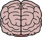
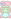
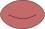
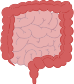
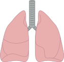
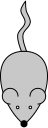
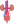
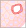

# bio

## 1tm_receptor

## bone

## brain

## cell1

## cell2

## cell3

## cell4

## cell5

## cell6

## dna

## erythrocyte

## heart

## human

## intestines

## kidney

## liver

## lungs

## mouse1

## renal_sys

## rna

## tissue

