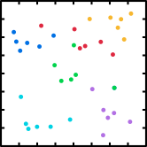
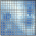
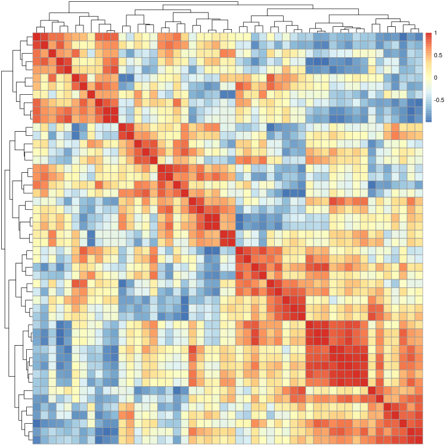
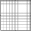
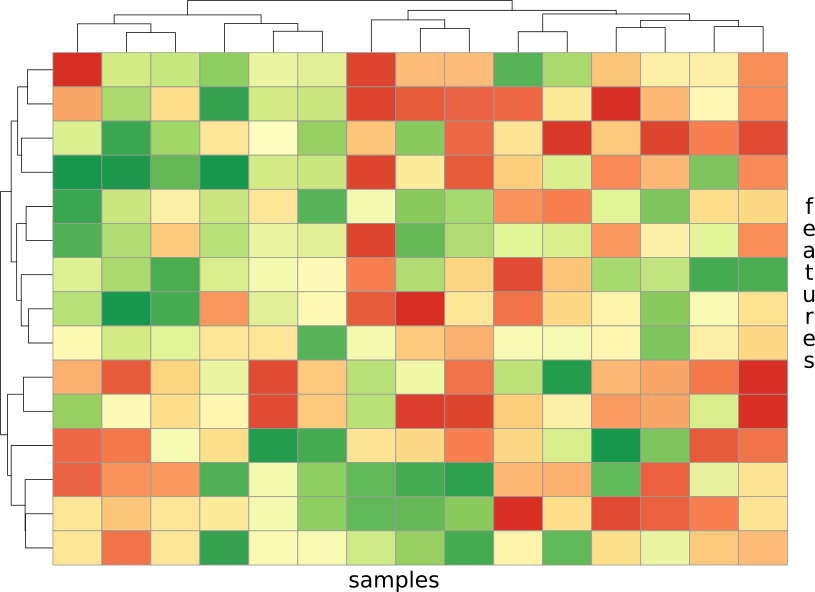
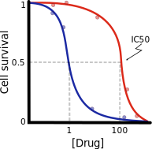
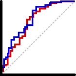
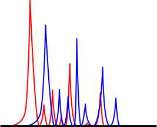
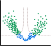

# plots

## PCA

## barplot

## boxplot

## bubble

## cmap20x20

## corr_hmap_mono_simple

## corr_hmap_ryb

## density_plot

## dotplot

## doughnut

## grid20x20

## hmap_ryg

## ic50

## linear_reg

## pie

## roc

## spectra

## spider

## stack_barplot

## time_series

## treemap

## venn3

## violin

## volcano

